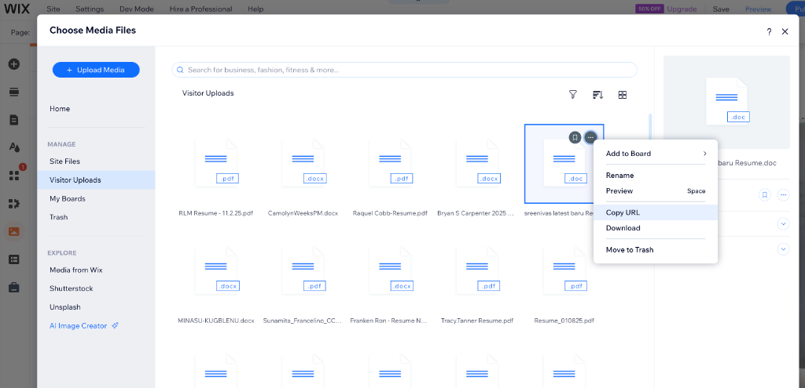

# Finding Your Wix Site ID

Your **Site ID** is required to download files that use `wix:document://` URLs. Here are two easy ways to find it.

---

## Method 1: Dashboard URL (Easiest!) ⭐

1. Log into [Wix.com](https://www.wix.com)
2. Open your website's dashboard
3. Look at the URL in your browser's address bar:

```
https://manage.wix.com/dashboard/c9b5b61e-3209-4638-9002-f1b14692676f/home
                                 └──────────── THIS IS YOUR SITE ID ────────────┘
```

4. Copy the long ID between `/dashboard/` and `/home`

**That's it!** Paste this ID into your `config.json`:

```json
{
  "site_id": "c9b5b61e-3209-4638-9002-f1b14692676f"
}
```

---

## Method 2: Media Manager (Alternative)

If you prefer to verify by getting an actual file URL:

1. In the Wix Editor, click **Media** in the left sidebar (or press M)
2. Go to **Visitor Uploads** under the MANAGE section
3. Right-click any uploaded file
4. Click **Copy URL**



The URL will look like this:
```
https://a18c1cea-079d-47d1-a94d-8a0aaf5dcd6f.usrfiles.com/ugd/anonym_abc123.pdf
        └──────────── THIS IS YOUR SITE ID ────────────┘
```

---

## Understanding the Site ID

The Site ID is a unique identifier for your Wix site. It's used in several URL formats:

| URL Type | Format |
|----------|--------|
| Dashboard | `manage.wix.com/dashboard/{SITE_ID}/...` |
| User Files | `{SITE_ID}.usrfiles.com/ugd/...` |
| Static Media | `static.wixstatic.com/media/...` |

---

## Multiple Sites?

If you have forms on multiple Wix sites, you'll need the Site ID for each one. The script converts `wix:document://` URLs using whichever Site ID you configure.

If your CSV exports contain direct `https://` URLs (not `wix:document://`), you may not need a Site ID at all - the script can download those directly.

---

## Troubleshooting

### "My downloads show errors"
- Make sure you're using the correct Site ID for that form
- Different Wix sites have different Site IDs

### "I can't find Visitor Uploads"
- You need to be in the Wix **Editor** (not the dashboard)
- Some older sites may have a different media manager layout

### "The URL doesn't match the pattern"
- Some URLs may use a different Wix subdomain
- Try Method 1 (Dashboard URL) which is more reliable
